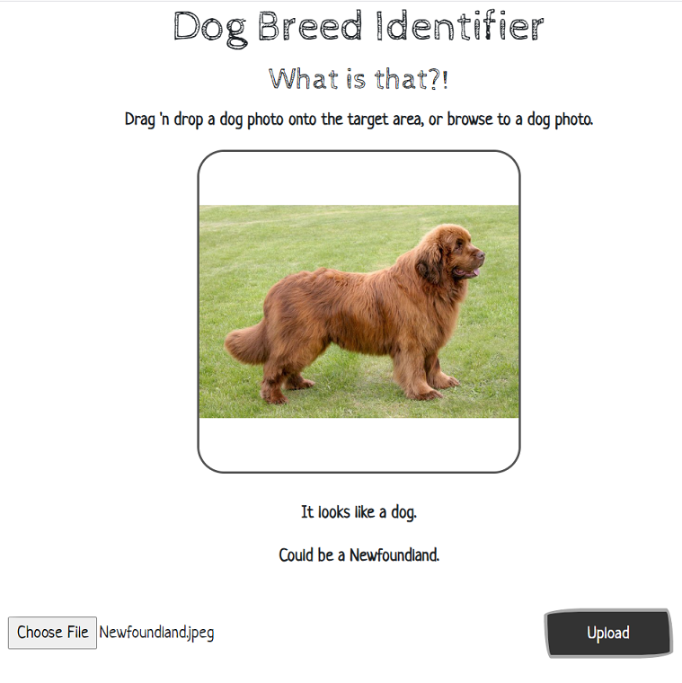

# Capstone Project on Dog Breed Identifier
This project has two parts which are intended to be run on different environment.

## Jupyter Notebook
The file `dog_app.ipynb` contains a detailed work done on the project. <br>
_Note: The Project Definition, Analysis, and Conclusion sections are added in the notebook itself._

Running the notebook produces the file `weights.best.Inception.hdf5` (among other files) under the folder **saved_models**, which is a required input file for the web application. A version of this file from prior execution is already been included in the repository.

## Web application
The web application uses prebuilt models for making predictions. This is a lightweight operation and intended to be run local PC.

## Setup

First we'll need to set up the Python environment. Open a conda terminal, and copy/paste in this one-liner:

```
$ conda create -n dog_tfp python=3.6 tensorflow keras flask opencv pillow numpy
```

This may take awhile.  When it completes, activate the new environment:

```
$ conda activate dog_tfp
```

It's assumed that the Git repository has already been cloned.  If not, do so now.

```
$ git clone https://github.com/Brijesh-Chandra/Dog-Breed-Identifier.git
```

The app also requires the [Inception bottleneck features](https://s3-us-west-1.amazonaws.com/udacity-aind/dog-project/DogInceptionV3Data.npz), which is quite a large file.  Download it to the **bottleneck_features** folder.

Now we're ready to start the web server.

```
$ cd dog-breed-identifier/web_app
$ python run.py
```

The server will initialize, and then provide a link, similar to this:

```
Using TensorFlow backend.
 * Serving Flask app "run" (lazy loading)
 * Environment: production
   WARNING: This is a development server. Do not use it in a production deployment.
   Use a production WSGI server instead.
 * Debug mode: off
 * Running on http://127.0.0.1:5000/ (Press CTRL+C to quit)
 ```

Open a browser and copy/paste the link onto the address bar.

_Note: The application will run with newer versions of python and tensorflow, but there will be a lot of runtime warnings. And loading of the application may take some time._

## Usage

To use the website, follow the instructions on the landing page.

## Result's Screenshot

